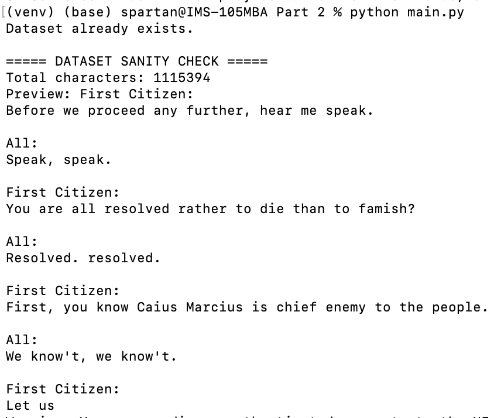
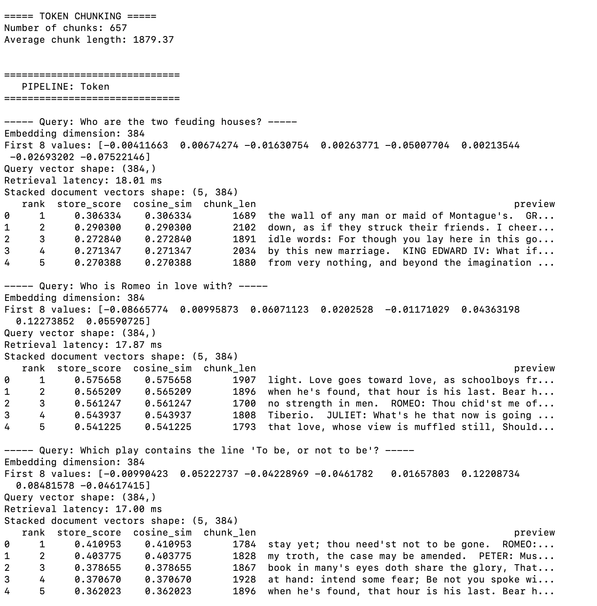
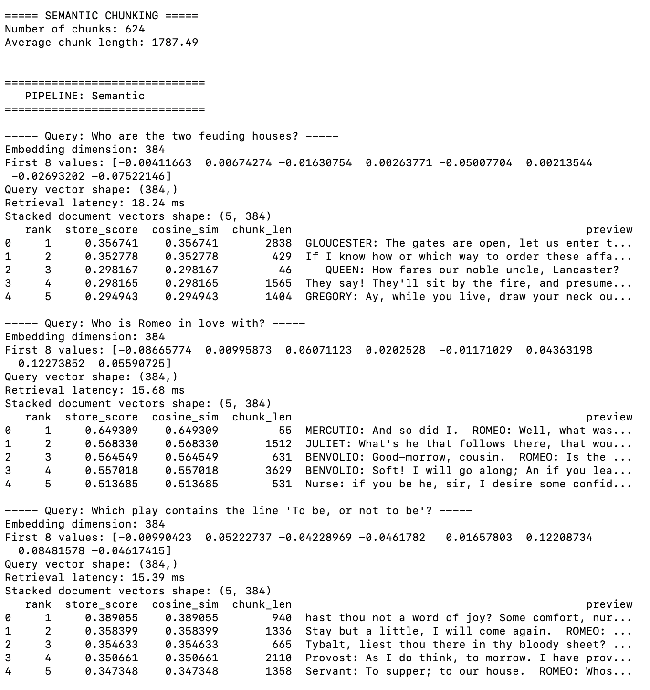
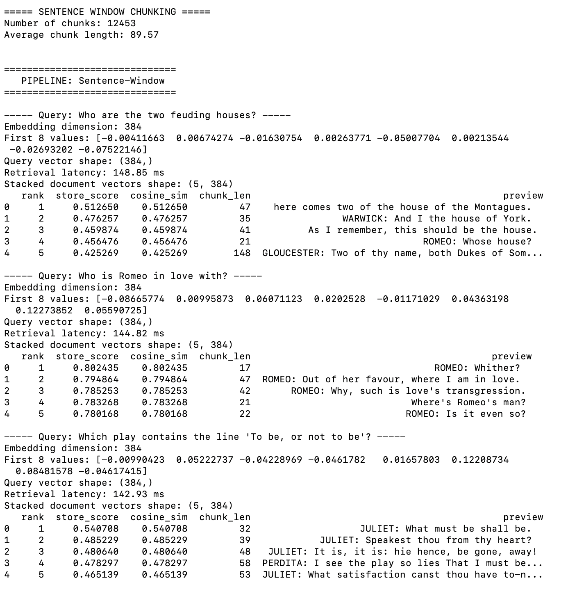

# LlamaIndex Chunking Comparison
**DATA236 – HW4 Part 2** | Retrieval-Only RAG Evaluation using Tiny Shakespeare

---

## 📌 Objective

This project compares three chunking strategies in LlamaIndex using the Tiny Shakespeare dataset. The goal is to evaluate retrieval quality using:

- Token-based chunking
- Semantic chunking
- Sentence-window chunking

All experiments use:
- HuggingFace embedding model: `sentence-transformers/all-MiniLM-L6-v2`
- In-memory vector indexing (`SimpleVectorStore`)
- Retrieval-only evaluation (no generation)

---

## 📂 Project Structure

```
.
├── main.py
├── requirements.txt
├── screenshots/
└── README.md
```

---

## ⚙️ Setup Instructions

```bash
python -m venv venv
source venv/bin/activate   # Mac/Linux
# venv\Scripts\activate    # Windows

pip install -r requirements.txt
python main.py
```

---

## 📚 Dataset

**Tiny Shakespeare** dataset:
[https://raw.githubusercontent.com/karpathy/char-rnn/master/data/tinyshakespeare/input.txt](https://raw.githubusercontent.com/karpathy/char-rnn/master/data/tinyshakespeare/input.txt)

Sanity checks performed:
- Total character count printed
- Preview of dataset printed

---

## 🔍 Chunking Techniques

### 1️⃣ Token-Based Chunking
- Uses `TokenTextSplitter`
- `chunk_size = 512`, `chunk_overlap = 50`
- Produces ~657 chunks | Average length ~1,879 characters

### 2️⃣ Semantic Chunking
- Uses `SemanticSplitterNodeParser`
- `buffer_size = 3`
- Embedding-based boundary detection
- Produces ~624 chunks | Average length ~1,787 characters

### 3️⃣ Sentence-Window Chunking
- Uses `SentenceWindowNodeParser`
- `window_size = 3`
- Sentence-level splitting with local context preserved via metadata
- Produces ~12,453 chunks | Average length ~89 characters

---
## 📸 Screenshots

### Dataset Preview


### Token-Based Chunking


### Semantic Chunking


### Sentence-Window Chunking


### Final Comparison

---

## 🧠 Retrieval Evaluation

### Queries Used

1. Who are the two feuding houses?
2. Who is Romeo in love with?
3. Which play contains the line "To be, or not to be"?

### Metrics Computed Per Query

| Metric | Description |
|---|---|
| Query embedding dimension | Shape of the query vector |
| First 8 embedding values | Embedding preview |
| Retrieval latency (ms) | Time to retrieve top-k chunks |
| Cosine similarity | Manually computed per chunk |
| Top-1 cosine similarity | Best match score |
| Mean@k cosine similarity | Average score over top-k results |
| Chunk length | Character count of retrieved chunk |
| Retrieved text preview | First ~200 chars of top result |
| Vector shape diagnostics | Shape of stored index vectors |

---

## 📊 Final Comparison Table

| Technique | Best Top-1 Cosine | Latency (ms) | # Chunks |
|---|---|---|---|
| Token | ~0.57 | ~15 ms | ~657 |
| Semantic | ~0.65 | ~18 ms | ~624 |
| Sentence-Window | ~0.80 | ~145 ms | ~12,453 |

> **Sentence-window chunking achieved the highest cosine similarity across all queries.**

---

## 🔎 Observations

- **Sentence-window chunking** performed best for entity-based and factual queries.
- Smaller sentence-level chunks improved semantic precision.
- **Token-based chunking** diluted relevant information in large segments.
- **Semantic chunking** improved boundary quality but sometimes grouped multiple dialogue topics together.
- Sentence-window achieved the strongest alignment but increased latency due to higher chunk count.

---

## 🏁 Conclusion

Sentence-window chunking consistently achieved the highest retrieval quality across all queries. Although it increases chunk count and retrieval latency, its fine-grained segmentation provides superior semantic alignment. Therefore, **sentence-window chunking is the most effective technique** for retrieval-only QA over the Tiny Shakespeare corpus.
